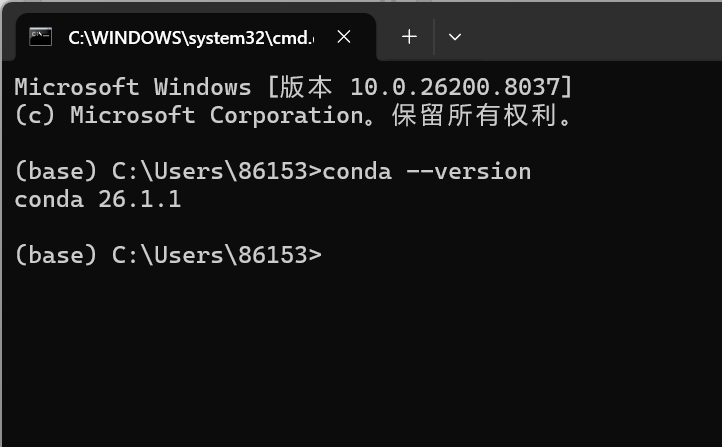
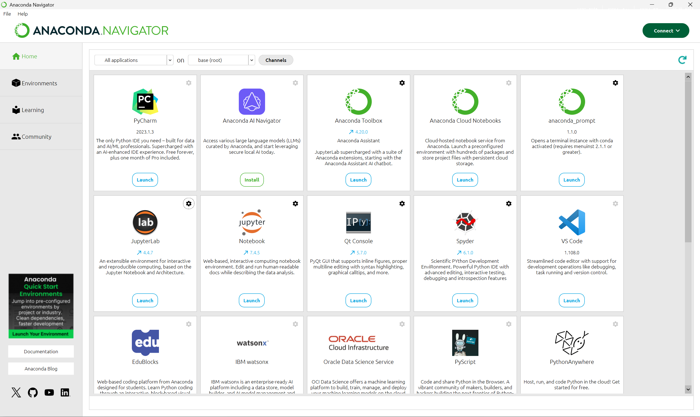
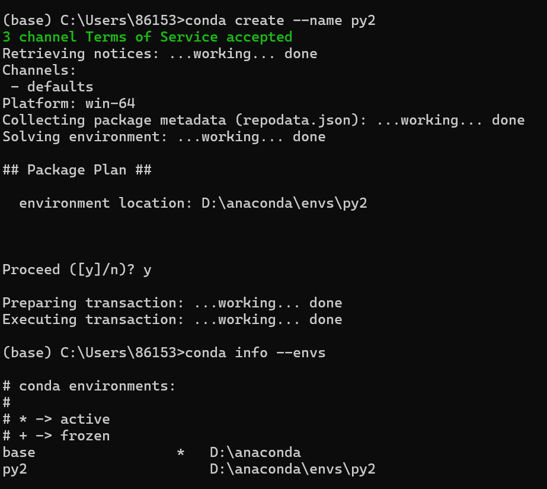
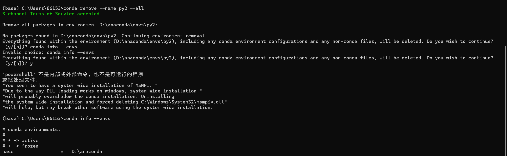

# Anaconda 下载与环境管理实验报告

## 一、实验目的
学习如何下载、安装 Anaconda，并掌握在 Anaconda 终端中创建、管理和删除虚拟环境的方法。

---

## 二、实验步骤

### 2.1 验证 Anaconda 安装完成

**操作说明：** 打开终端（Windows 命令提示符或 PowerShell），输入 `conda --version` 命令验证安装是否成功。

**截图：**

---

### 2.2 Anaconda Navigator 界面

**操作说明：** 启动 Anaconda Navigator，查看主界面。

**截图：**

---

### 2.3 创建与管理虚拟环境

**操作说明：** 在 Anaconda Prompt 中使用 `conda create` 命令创建新环境，并使用 `conda activate` 激活环境。

**截图：**

---

### 2.4 删除虚拟环境

**操作说明：** 在 Anaconda Prompt 中使用 `conda remove` 命令删除不再需要的虚拟环境。

**截图：**

---

### 2.5 使用 Anaconda Navigator 启动 Notebook 并更改保存路径

**操作说明：** 在 Anaconda Navigator 中启动 Jupyter Notebook，通过 `File > New Notebook > Python 3` 创建新笔记本，并通过 `File > Save As` 更改文件保存路径。

**截图：**

---

### 2.6 使用 Notebook 编写 Markdown 文档与 Python 代码

**操作说明：** 在 Jupyter Notebook 中创建 Markdown 单元格编写文档说明，创建代码单元格编写 Python 代码并运行。

**截图：**

---

## 三、实验总结
通过本次实验，成功掌握了 Anaconda 的安装验证方法以及虚拟环境的创建、管理和删除操作。

---
