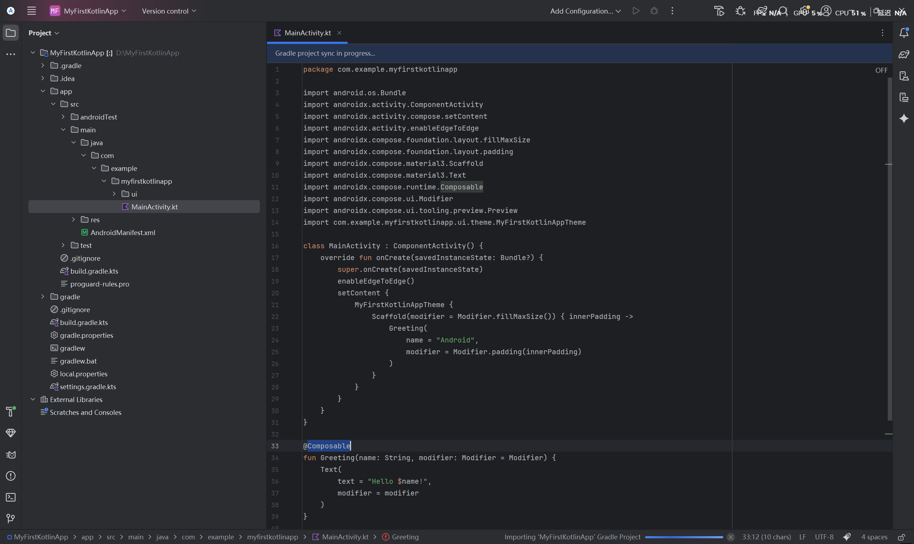
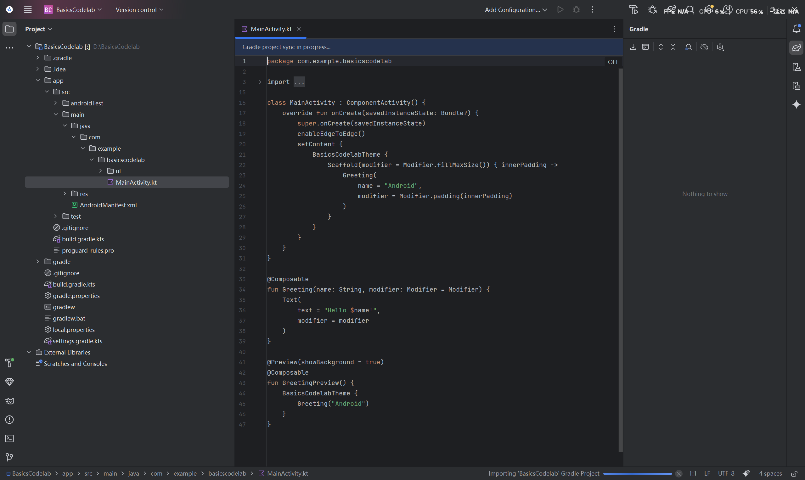
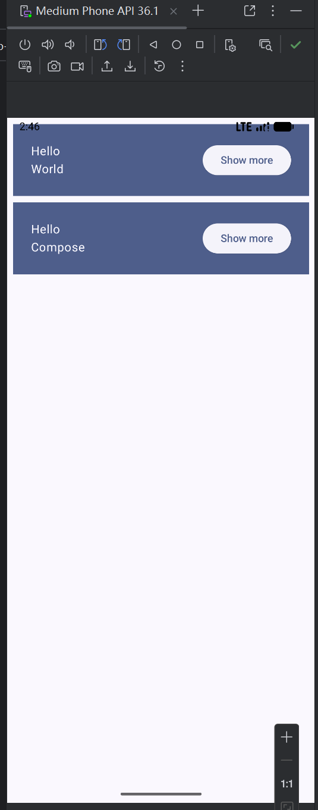
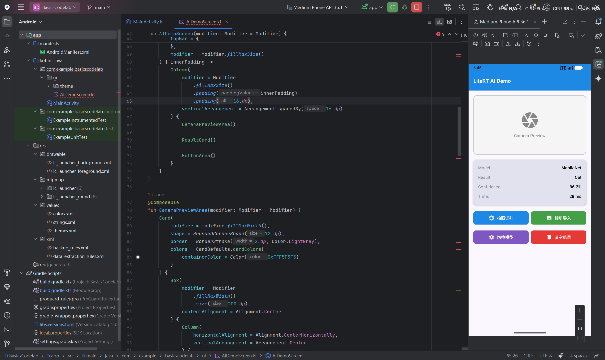

# 基于 Kotlin 语言的 Android 开发实验报告

## 一、实验目的

学习基于 Kotlin 语言的 Android 开发，掌握使用 Kotlin 和 Jetpack Compose 进行 Android 应用开发的基本技能。

***

## 二、实验环境

- **操作系统**：Windows 10/11
- **开发工具**：Android Studio
- **Kotlin 版本**：2.0+
- **Jetpack Compose 版本**：最新稳定版
- **实验平台**：Google Android 开发者官方教程

***

## 三、实验任务

### 任务一：完成首个 Kotlin APP 的构建

按照官方 Android 教程，创建并运行第一个 Kotlin 编写的 Android 应用。熟悉 Android Studio 开发环境，掌握项目创建、代码编写、界面布局和运行调试的基本流程。

**完成截图：**

### 任务二：完成 Compose 布局的实践

学习 Jetpack Compose 声明式 UI 框架，掌握 Compose 的核心概念和布局组件使用。通过实践熟练运用 Compose 进行现代化的 Android 界面开发。

#### 2.1 创建新 Compose 项目

在 Android Studio 中创建一个新的 Compose 项目，选择 Empty Compose Activity 模板，配置项目名称和目标设备。

**创建项目截图：**

#### 2.2 行列按钮互动代码实现

使用 Compose 的 Column、Row 布局组件和 Button 组件，实现行列按钮的互动效果。通过状态管理实现按钮点击后的响应逻辑。

**代码截图：**

#### 2.3 运行效果

完成代码编写后，运行应用查看实际效果，验证行列按钮互动功能是否正常工作。

**运行效果截图：**

### 任务三：完成面向 AI 应用的 Compose 布局

结合人工智能技术，设计并实现一个简单的 AI 应用界面。运用 Compose 布局组件展示 AI 功能界面，实践 Kotlin 与 AI 技术的结合应用。

#### 3.1 界面设计与代码实现

设计一个基于 AI 图像识别的应用界面，包含顶部标题栏、相机预览区、识别结果展示区和功能按钮区。使用 Compose 的 Column、Row、Card、Button、Icon 等组件实现完整的界面布局。

**代码与效果截图：**

***

## 四、实验总结

通过本次实验，系统学习了基于 Kotlin 语言的 Android 开发方法，熟练掌握了 Jetpack Compose 声明式 UI 开发框架的使用，为后续开发更复杂的 Android 应用奠定了基础。