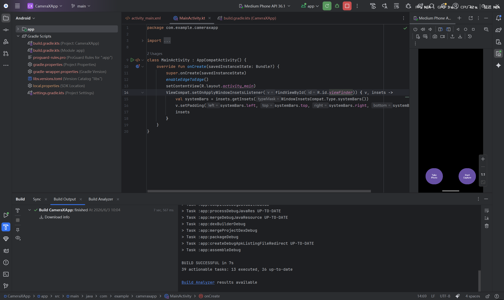
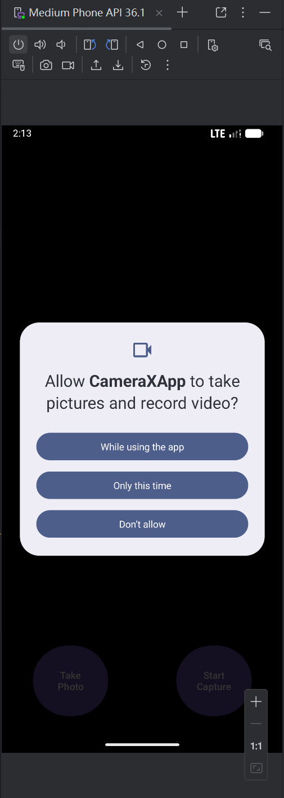
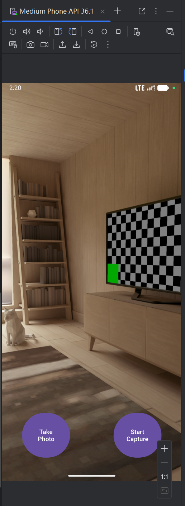
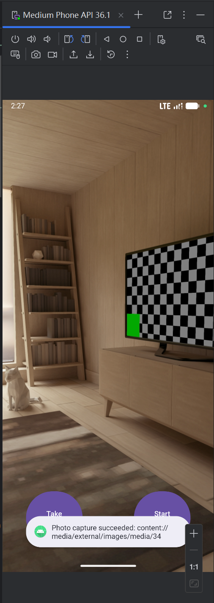
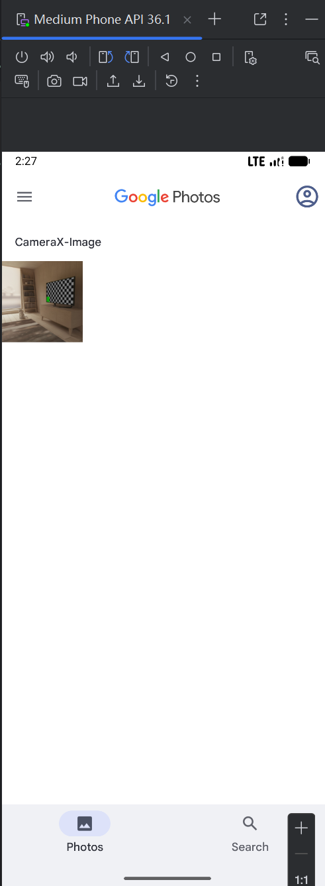
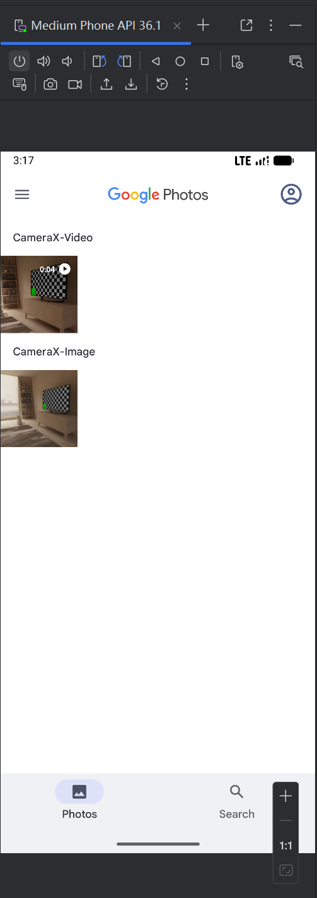

# CameraX 相机应用开发实验报告

## 一、实验目的

学习和实践 Android CameraX 框架的使用，掌握相机预览、拍照、视频录制等核心功能的实现方法，理解 CameraX 生命周期管理和用例组合机制。

***

## 二、实验环境

- **操作系统**：Windows 10/11
- **开发工具**：Android Studio Hedgehog
- **目标平台**：Android API 34
- **框架**：CameraX 1.1.0-beta01
- **语言**：Kotlin

***

## 三、实验步骤

### 3.1 项目创建

在 Android Studio 中创建新的 CameraX 项目，配置必要的依赖项。

**实验注解：**
- **对应文件**：`CameraXApp/app/build.gradle.kts`
- **核心配置**：添加 CameraX 核心依赖（camera-core、camera-camera2、camera-lifecycle、camera-video、camera-view）
- **技术要点**：Gradle 依赖管理、ViewBinding 启用

**项目创建截图：**


### 3.2 App 权限申请

配置 AndroidManifest.xml 权限声明，并实现运行时权限申请。

**实验注解：**
- **对应文件**：`CameraXApp/app/src/main/AndroidManifest.xml`、`CameraXApp/app/src/main/java/com/example/cameraxapp/MainActivity.kt`
- **权限声明**：CAMERA、RECORD_AUDIO、WRITE_EXTERNAL_STORAGE
- **技术要点**：ActivityCompat.requestPermissions、onRequestPermissionsResult 回调

**权限申请截图：**


### 3.3 App 相机打开

使用 CameraX Preview 用例实现相机实时预览功能。

**实验注解：**
- **对应文件**：`CameraXApp/app/src/main/java/com/example/cameraxapp/MainActivity.kt`、`CameraXApp/app/src/main/res/layout/activity_main.xml`
- **核心组件**：`ProcessCameraProvider`、`Preview`、`CameraSelector`
- **技术要点**：相机提供者初始化、生命周期绑定、SurfaceProvider 设置

**相机预览效果：**


### 3.4 拍摄图片功能

使用 CameraX ImageCapture 用例实现拍照功能，将照片保存到系统相册。

**实验注解：**
- **对应文件**：`CameraXApp/app/src/main/java/com/example/cameraxapp/MainActivity.kt`
- **核心组件**：`ImageCapture`、`MediaStoreOutputOptions`
- **技术要点**：ContentValues 设置、MediaStore 集成、异步回调处理

**拍摄效果截图：**

**图片 1：**


**图片 2：**


### 3.5 录制视频功能

使用 CameraX VideoCapture 用例实现视频录制功能，支持音频录制。

**实验注解：**
- **对应文件**：`CameraXApp/app/src/main/java/com/example/cameraxapp/MainActivity.kt`
- **核心组件**：`Recorder`、`VideoCapture`、`Recording`
- **技术要点**：录制状态管理、音频权限检查、视频文件保存

**视频录制效果：**


***

## 四、实验总结

通过本次实验，系统学习了 CameraX 框架的核心概念和使用方法，成功实现了一个功能完整的相机应用。

### 实验收获

| 步骤 | 知识点 | 技能提升 |
|------|--------|----------|
| 项目创建 | CameraX 依赖配置 | 掌握 Android 项目依赖管理 |
| 权限申请 | 运行时权限申请 | 掌握 Android 权限管理 |
| 相机打开 | Preview 用例、生命周期绑定 | 掌握相机预览实现方法 |
| 拍摄图片 | ImageCapture 用例、MediaStore 集成 | 掌握拍照和图片保存 |
| 录制视频 | VideoCapture 用例、Recorder 配置 | 掌握视频录制功能 |

### 代码文件清单

| 文件路径 | 功能描述 |
|----------|----------|
| `CameraXApp/app/build.gradle.kts` | 项目依赖配置 |
| `CameraXApp/app/src/main/AndroidManifest.xml` | 权限声明 |
| `CameraXApp/app/src/main/java/com/example/cameraxapp/MainActivity.kt` | 主活动（预览、拍照、录像） |
| `CameraXApp/app/src/main/res/layout/activity_main.xml` | 界面布局（PreviewView、按钮） |

### 项目代码位置

CameraX 实验项目代码已上传至 GitHub 仓库：[https://github.com/Melon-Ak/Experiments](https://github.com/Melon-Ak/Experiments)

**项目结构：**
```
CameraXApp/
├── app/
│   ├── src/main/java/com/example/cameraxapp/MainActivity.kt
│   ├── src/main/res/layout/activity_main.xml
│   ├── src/main/res/values/strings.xml
│   └── build.gradle.kts
└── settings.gradle.kts
```

您可以通过上述链接查看完整的项目代码实现。

***