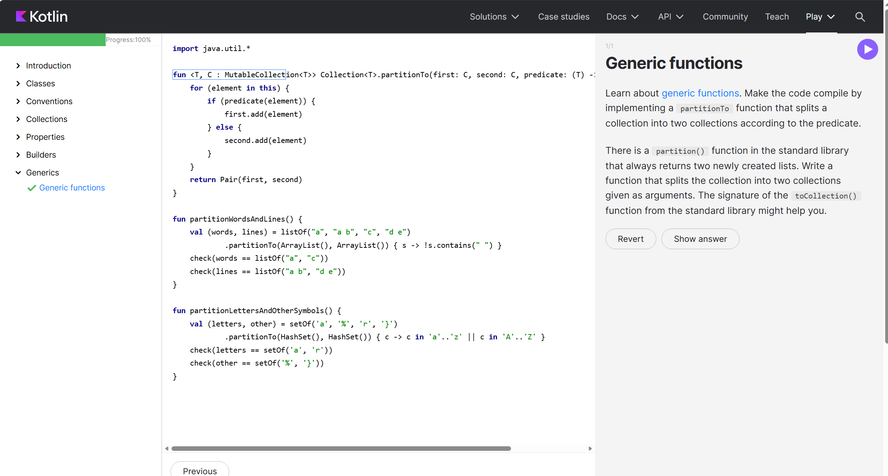

# Kotlin 基本语法实验报告

## 一、实验目的
通过完成 Kotlin Koans 语法练习，系统学习和掌握 Kotlin 编程语言的基本语法特性，包括变量声明、函数定义、控制流、数据类、集合操作、Lambda 表达式等核心知识点。

---

## 二、实验环境
- **操作系统**：Windows 10/11
- **开发工具**：IntelliJ IDEA
- **Kotlin 版本**：2.0+
- **学习平台**：Kotlin Koans（https://play.kotlinlang.org/koans）

---

## 三、实验步骤

### 3.1 访问 Kotlin Koans 平台
打开浏览器访问 Kotlin Koans 在线学习平台，登录后开始语法练习。

### 3.2 完成语法测试
按照平台提供的题目顺序，依次完成以下模块的练习：
1. **Introduction** - Kotlin 基础入门
2. **Basic Types** - 基本数据类型
3. **Control Flow** - 控制流语句
4. **Collections** - 集合操作
5. **Functions** - 函数定义与调用
6. **Data Classes** - 数据类
7. **Null Safety** - 空安全
8. **Extensions** - 扩展函数
9. **Lambdas** - Lambda 表达式
10. **Higher-Order Functions** - 高阶函数

### 3.3 验证完成状态
完成所有语法测试后，查看进度面板确认全部练习已完成。

**完成截图：**

---

## 四、实验总结

### 4.1 学习收获
1. 掌握了 Kotlin 的基本语法结构和编程范式
2. 理解了 Kotlin 的空安全机制，相比 Java 更加安全可靠
3. 学会了使用 Lambda 表达式和高阶函数进行函数式编程
4. 熟悉了 Kotlin 的集合操作和扩展函数的使用

### 4.2 重点难点
- **空安全**：理解 `?`、`!!` 和 `?:` 的使用场景
- **Lambda 表达式**：掌握闭包、匿名函数和高阶函数的概念
- **扩展函数**：学会在不修改类源码的情况下为类添加新功能

### 4.3 实践意义
通过 Kotlin Koans 的系统性练习，为后续使用 Kotlin 进行 Android 开发或后端开发打下了坚实的基础。

---

## 图片文件说明

请将以下图片放置在文档同级目录的 `images` 文件夹中：
- `kotlin_koans_complete.png` - Kotlin Koans 全部语法测试完成的截图

如果图片存放在其他位置，请修改上述图片路径。