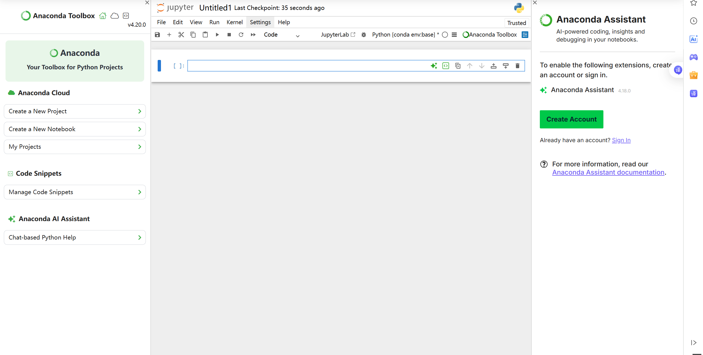
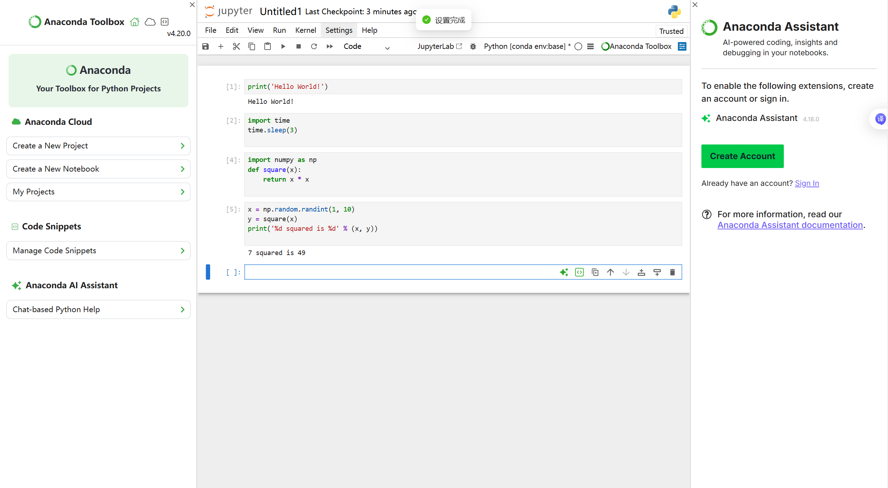
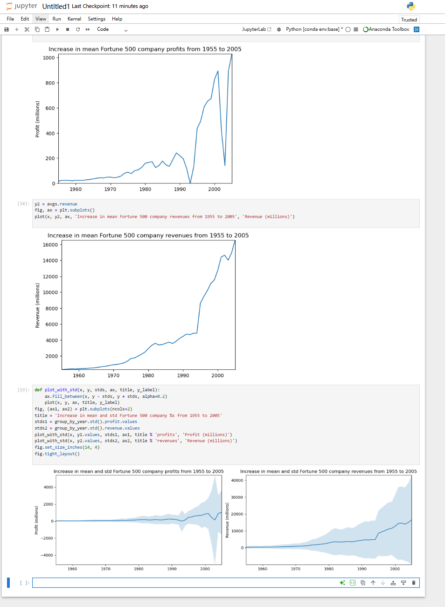

# Jupyter Notebook 基础使用实验报告

## 一、实验目的

学习和掌握 Jupyter Notebook 的基本使用方法，包括创建笔记本、编写和运行代码、数据分析与可视化等核心功能，为后续数据科学和机器学习实验打下基础。

***

## 二、实验环境

- **操作系统**：Windows 10/11
- **开发工具**：Jupyter Notebook / JupyterLab
- **编程语言**：Python 3.x
- **数据分析库**：pandas、matplotlib、numpy
- **实验数据**：`fortune500.csv`

***

## 三、实验步骤

### 3.1 创建新文件

打开 Jupyter Notebook，创建一个新的 Python 笔记本文件。

**实验注解：**
- **对应文件**：`Untitled1.ipynb`
- **核心操作**：启动 Jupyter Notebook 服务，通过界面创建新笔记本
- **技术要点**：熟悉 Jupyter Notebook 界面布局、单元格操作、快捷键使用

**创建新文件截图：**

### 3.2 基本语法测试

在笔记本中编写并运行 Python 基本语法测试代码，包括变量定义、数据类型、控制流等。

**实验注解：**
- **对应文件**：`Untitled1.ipynb`
- **核心内容**：Python 基础语法练习（变量、列表、字典、循环、函数）
- **技术要点**：单元格的编辑与运行、Markdown 文档编写、代码注释

**基本语法测试截图：**

### 3.3 数据读取与分析

使用 pandas 读取 `fortune500.csv` 数据文件，进行数据探索和分析。

**实验注解：**
- **对应文件**：`Untitled1.ipynb`、`fortune500.csv`
- **核心操作**：使用 `pandas.read_csv()` 读取数据，`df.head()`、`df.describe()` 探索数据
- **技术要点**：CSV 文件读取、数据框操作、基本统计分析

### 3.4 数据可视化

使用 matplotlib 对数据进行可视化展示，绘制图表分析 Fortune 500 企业数据。

**实验注解：**
- **对应文件**：`Untitled1.ipynb`
- **核心操作**：绘制柱状图、折线图、散点图等
- **技术要点**：matplotlib 基本绘图、图表美化、子图布局

**画图分析数据截图：**

### 3.5 导出文档

完成分析后，将笔记本导出为 .ipynb 格式保存。

**实验注解：**
- **对应文件**：`Untitled1.ipynb`
- **核心操作**：通过 File → Save as 或快捷键保存
- **技术要点**：笔记本格式、导出选项、版本管理

***

## 四、实验总结

通过本次实验，系统学习了 Jupyter Notebook 的基本使用方法，掌握了数据读取、分析和可视化的核心技能。

### 实验收获

| 步骤 | 知识点 | 技能提升 |
|------|--------|----------|
| 创建文件 | Jupyter Notebook 界面操作 | 掌握笔记本创建和管理 |
| 语法测试 | Python 基本语法 | 熟悉在笔记本中编写和运行代码 |
| 数据读取 | pandas 数据处理 | 掌握 CSV 文件读取和数据探索 |
| 数据可视化 | matplotlib 绘图 | 掌握数据可视化方法 |
| 导出文档 | 笔记本保存格式 | 了解 Jupyter 文件格式 |

### 代码文件清单

| 文件路径 | 功能描述 |
|----------|----------|
| `Untitled1.ipynb` | Jupyter Notebook 实验代码 |
| `fortune500.csv` | Fortune 500 企业数据 |

### 项目代码位置

实验项目代码已上传至 GitHub 仓库：[https://github.com/Melon-Ak/Experiments](https://github.com/Melon-Ak/Experiments)

您可以通过上述链接查看完整的实验代码和数据文件。

***