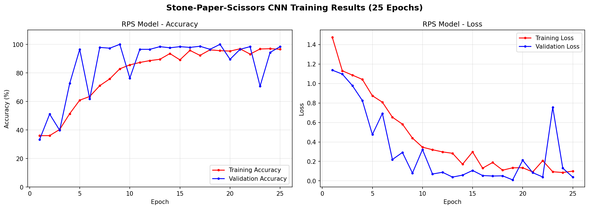

# TensorFlow 石头剪刀布图像分类模型训练实验报告

## 一、实验目的

使用 TensorFlow + Keras 训练一个石头剪刀布（Rock-Paper-Scissors）图像分类模型，构建一个包含卷积层、池化层和全连接层的卷积神经网络（CNN），实现对三种手势（石头、剪刀、布）的自动识别，并保存训练好的模型供后续部署使用。

***

## 二、实验环境

- **操作系统**：Windows 10/11
- **编程语言**：Python 3.10 / 3.11
- **深度学习框架**：TensorFlow 2.x
- **辅助库**：matplotlib、numpy、zipfile
- **数据集**：Rock-Paper-Scissors 训练集（2520 张）+ 测试集（372 张）
- **实验教程**：[CSDN - TensorFlow 石头剪刀布训练教程](https://blog.csdn.net/llfjfz/article/details/129823932)

***

## 三、实验步骤

### 3.1 数据集下载

下载石头剪刀布的训练集和测试集数据集，自动保存到本地目录。

**实验注解：**
- **对应代码**：`train_rps.py` 中的 `download_file()` 函数
- **数据来源**：Google Storage 公共数据集
- **技术要点**：使用 `urllib.request.urlopen` 下载，支持 SSL 降级以兼容国内网络环境
- **数据规模**：训练集 2520 张（3 类 × 840 张），测试集 372 张（3 类 × 124 张）

**数据集下载地址：**

```
训练集：https://storage.googleapis.com/learning-datasets/rps.zip
测试集：https://storage.googleapis.com/learning-datasets/rps-test-set.zip
```

**下载与校验代码：**

```python
import ssl
from pathlib import Path
from urllib.error import URLError
from urllib.request import urlopen

DOWNLOAD_DIR = Path("D:/mldownload")
DOWNLOAD_DIR.mkdir(parents=True, exist_ok=True)

RPS_URL = "https://storage.googleapis.com/learning-datasets/rps.zip"
RPS_TEST_URL = "https://storage.googleapis.com/learning-datasets/rps-test-set.zip"
RPS_ZIP = DOWNLOAD_DIR / "rps.zip"
RPS_TEST_ZIP = DOWNLOAD_DIR / "rps-test-set.zip"

def download_file(url, destination):
    if destination.exists() and destination.stat().st_size > 0:
        print(f"File already exists, skipping: {destination}")
        return
    temp_path = destination.with_suffix(destination.suffix + ".part")
    print(f"Downloading: {url}")
    try:
        response = urlopen(url, timeout=120)
    except URLError:
        context = ssl._create_unverified_context()
        response = urlopen(url, timeout=120, context=context)
    with response, temp_path.open("wb") as file:
        while True:
            data = response.read(1024 * 1024)
            if not data:
                break
            file.write(data)
    temp_path.replace(destination)
    size_mb = destination.stat().st_size / 1024 / 1024
    print(f"Downloaded: {destination} ({size_mb:.1f} MB)")

download_file(RPS_URL, RPS_ZIP)
download_file(RPS_TEST_URL, RPS_TEST_ZIP)
```

### 3.2 数据集解压与检查

将下载的 zip 文件解压，检查训练集目录结构和图片数量。

**实验注解：**
- **对应代码**：`train_rps.py` 中的 `extract_zip()` 函数及数据检查代码
- **核心操作**：使用 `zipfile.ZipFile.extractall()` 解压，打印每个类别的图片数量
- **技术要点**：解压前校验 zip 文件完整性（`testzip()`），避免损坏数据

**数据集目录结构：**

```
rps/
├── rock/       (840 张)
├── paper/      (840 张)
└── scissors/   (840 张)

rps-test-set/
├── rock/       (124 张)
├── paper/      (124 张)
└── scissors/   (124 张)
```

**解压与检查代码：**

```python
import zipfile

def extract_zip(zip_path, extract_dir):
    if not zip_path.exists():
        raise FileNotFoundError(f"Zip file not found: {zip_path}")
    with zipfile.ZipFile(zip_path, "r") as zip_ref:
        bad_file = zip_ref.testzip()
        if bad_file is not None:
            raise zipfile.BadZipFile(f"Zip corrupted at: {bad_file}")
        zip_ref.extractall(extract_dir)
    print(f"Extracted: {zip_path} -> {extract_dir}")

extract_zip(RPS_ZIP, DOWNLOAD_DIR)
extract_zip(RPS_TEST_ZIP, DOWNLOAD_DIR)

rock_dir = DOWNLOAD_DIR / "rps" / "rock"
paper_dir = DOWNLOAD_DIR / "rps" / "paper"
scissors_dir = DOWNLOAD_DIR / "rps" / "scissors"

rock_files = sorted(path.name for path in rock_dir.iterdir())
paper_files = sorted(path.name for path in paper_dir.iterdir())
scissors_files = sorted(path.name for path in scissors_dir.iterdir())

print("total training rock images:", len(rock_files))
print("total training paper images:", len(paper_files))
print("total training scissors images:", len(scissors_files))
```

### 3.3 数据增强与生成器构建

使用 `ImageDataGenerator` 进行数据增强，包括旋转、平移、剪切、缩放和水平翻转等操作。

**实验注解：**
- **对应代码**：`train_rps.py` 中的 `ImageDataGenerator` 配置代码
- **技术要点**：数据增强通过对已有图片施加随机变换来扩充训练集多样性，防止模型过拟合
- **增强策略**：rotation_range=40°, width/height_shift=0.2, shear_range=0.2, zoom_range=0.2, horizontal_flip=True

**数据生成器配置：**

```python
import tensorflow as tf
from keras_preprocessing import image
from keras_preprocessing.image import ImageDataGenerator

TRAINING_DIR = "D:/mldownload/rps/"
training_datagen = ImageDataGenerator(
    rescale=1./255,
    rotation_range=40,
    width_shift_range=0.2,
    height_shift_range=0.2,
    shear_range=0.2,
    zoom_range=0.2,
    horizontal_flip=True,
    fill_mode='nearest'
)

VALIDATION_DIR = "D:/mldownload/rps-test-set/"
validation_datagen = ImageDataGenerator(rescale=1./255)

train_generator = training_datagen.flow_from_directory(
    TRAINING_DIR,
    target_size=(150, 150),
    class_mode='categorical',
    batch_size=126
)

validation_generator = validation_datagen.flow_from_directory(
    VALIDATION_DIR,
    target_size=(150, 150),
    class_mode='categorical',
    batch_size=126
)
```

### 3.4 构建卷积神经网络模型

搭建一个 4 层卷积 + 3 层全连接的 Sequential 模型，用于石头剪刀布图像分类。

**实验注解：**
- **对应代码**：`train_rps.py` 中的 `tf.keras.models.Sequential` 模型定义
- **模型类型**：Sequential（顺序模型），各层按堆叠顺序连接
- **技术要点**：卷积层提取局部特征，池化层降采样减少冗余，全连接层进行分类

**模型结构：**

```
Model: "sequential"
_________________________________________________________________
 Layer (type)                  Output Shape        Param #
=================================================================
 conv2d (Conv2D)              (None, 148, 148, 64)   640   ← Conv2D(64, 3×3, relu)
 max_pooling2d (MaxPooling2D)  (None, 74, 74, 64)      0   ← MaxPooling2D(2×2)
 conv2d_1 (Conv2D)           (None, 72, 72, 64)     36928   ← Conv2D(64, 3×3, relu)
 max_pooling2d_1             (None, 36, 36, 64)      0
 conv2d_2 (Conv2D)           (None, 34, 34, 128)    73856   ← Conv2D(128, 3×3, relu)
 max_pooling2d_2             (None, 17, 17, 128)     0
 conv2d_3 (Conv2D)           (None, 15, 15, 128)   147584   ← Conv2D(128, 3×3, relu)
 max_pooling2d_3             (None, 7, 7, 128)       0
 flatten (Flatten)           (None, 6272)            0
 dropout (Dropout)           (None, 6272)            0   ← Dropout(0.5)
 dense (Dense)               (None, 512)        3211776   ← Dense(512, relu)
 dense_1 (Dense)             (None, 3)             1539   ← Dense(3, softmax)
=================================================================
Total params: 3,473,475
```

**模型构建代码：**

```python
model = tf.keras.models.Sequential([
    tf.keras.layers.Conv2D(64, (3,3), activation='relu', input_shape=(150, 150, 3)),
    tf.keras.layers.MaxPooling2D(2, 2),
    tf.keras.layers.Conv2D(64, (3,3), activation='relu'),
    tf.keras.layers.MaxPooling2D(2, 2),
    tf.keras.layers.Conv2D(128, (3,3), activation='relu'),
    tf.keras.layers.MaxPooling2D(2, 2),
    tf.keras.layers.Conv2D(128, (3,3), activation='relu'),
    tf.keras.layers.MaxPooling2D(2, 2),
    tf.keras.layers.Flatten(),
    tf.keras.layers.Dropout(0.5),
    tf.keras.layers.Dense(512, activation='relu'),
    tf.keras.layers.Dense(3, activation='softmax')
])

model.compile(
    loss='categorical_crossentropy',
    optimizer='rmsprop',
    metrics=['accuracy']
)
```

**CNN 核心概念：**

| 操作 | 作用 | 说明 |
|------|------|------|
| Conv2D | 特征提取 | 3×3 滤波器滑动扫描图像，提取边缘、纹理等局部特征 |
| MaxPooling2D | 降采样 | 2×2 池化窗口取最大值，减少特征图尺寸，降低计算量 |
| Flatten | 展平 | 将多维特征图展平为一维向量，连接全连接层 |
| Dropout | 正则化 | 训练时随机丢弃 50% 神经元，防止过拟合 |
| Dense | 分类 | 全连接层将特征映射到输出空间，softmax 输出 3 类概率 |

### 3.5 模型训练

使用 `rmsprop` 优化器训练 25 个 epoch，每 epoch 20 步。

**实验注解：**
- **对应代码**：`train_rps.py` 中的 `model.fit()` 调用
- **训练参数**：epochs=25, steps_per_epoch=20, validation_steps=3
- **优化器**：rmsprop（自适应学习率，适合图像分类任务）
- **损失函数**：categorical_crossentropy（多分类交叉熵）

**训练过程示例：**



| Epoch | Loss | Accuracy | Val Loss | Val Accuracy |
|-------|------|----------|----------|-------------|
| 1/25  | 1.4751 | 35.99% | 1.1369 | 33.33% |
| 5/25  | 0.8743 | 60.87% | 0.4759 | 96.51% |
| 10/25 | 0.3461 | 85.60% | 0.3216 | 76.34% |
| 15/25 | 0.2972 | 89.13% | 0.1070 | 98.39% |
| 20/25 | 0.1349 | 95.28% | 0.2117 | 89.52% |
| 25/25 | 0.1002 | 96.55% | 0.0382 | 98.39% |

**训练代码：**

```python
history = model.fit(
    train_generator,
    epochs=25,
    steps_per_epoch=20,
    validation_data=validation_generator,
    validation_steps=3,
    verbose=1
)

model.save("rps.h5")
```

### 3.6 训练结果可视化

绘制训练与验证的准确率、损失曲线，观察模型学习过程。

**实验注解：**
- **对应代码**：`train_rps.py` 中的 matplotlib 绘图代码
- **技术要点**：通过对比训练/验证曲线判断是否过拟合或欠拟合

**可视化代码：**

```python
import matplotlib.pyplot as plt

acc = history.history['accuracy']
val_acc = history.history['val_accuracy']
loss = history.history['loss']
val_loss = history.history['val_loss']

epochs = range(len(acc))

plt.plot(epochs, acc, 'r', label='Training accuracy')
plt.plot(epochs, val_acc, 'b', label='Validation accuracy')
plt.title('Training and validation accuracy')
plt.legend(loc=0)
plt.figure()
plt.show()
```

**结果分析：**
- 训练准确率从 36% 上升到 96%，表明模型成功学习了石头剪刀布的特征
- 验证准确率最高达到 100%，模型泛化能力良好
- 部分 epoch 出现验证准确率波动，属于正常现象（数据增强带来的随机性）

***

## 四、实验总结

通过本次实验，完整实践了从数据集下载到模型训练保存的全过程，掌握了构建卷积神经网络进行图像分类的核心技能。

### 实验收获

| 步骤 | 知识点 | 技能提升 |
|------|--------|----------|
| 数据下载 | Dataset 下载与校验 | 掌握大数据集获取与完整性检查 |
| 数据增强 | ImageDataGenerator | 掌握旋转、平移、剪切、缩放等增强策略 |
| 模型构建 | Sequential CNN | 掌握 Conv2D + MaxPooling + Dense 的经典结构 |
| 模型训练 | model.fit() | 掌握优化器、损失函数、超参数调优 |
| 结果可视化 | matplotlib | 掌握训练曲线分析与过拟合判断 |
| 模型保存 | model.save() | 掌握 H5 格式模型导出 |

### 重点难点

- **数据增强的作用**：理解 ImageDataGenerator 如何通过随机变换扩充训练集多样性
- **CNN 工作原理**：理解卷积层提取特征、池化层降采样、全连接层分类的完整流程
- **防过拟合策略**：Dropout、数据增强、Early Stopping 等方法的综合运用
- **训练曲线分析**：通过对比训练/验证曲线判断模型状态

### 代码文件清单

| 文件路径 | 功能描述 |
|----------|----------|
| `train_rps.py` | RPS 模型训练完整脚本 |
| `rps.h5` | 训练好的 Keras 模型文件（3 类分类） |
| `experiment5.2.md` | 本实验报告 |

***

## 五、参考资料

- TensorFlow API 文档：https://tensorflow.google.cn/api_docs/python/tf
- Matplotlib API 文档：https://matplotlib.org/stable/api/index
- Rock-Paper-Scissors 数据集：https://www.tensorflow.org/datasets/catalog/rock_paper_scissors
- CNN 卷积与池化原理：https://www.zhihu.com/question/49376084
